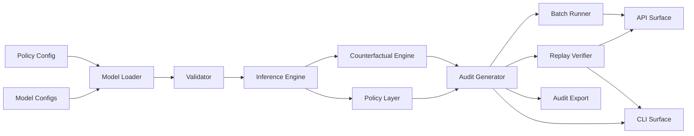

# causal-credit-risk-engine


Config-driven causal inference engine for explainable credit-risk decisions, counterfactuals, and audit traces.

`causal-credit-risk-engine` is a production-shaped Python package for demonstrating how causal AI can support explainability, human oversight, decision traceability, and governance workflows in high-risk AI contexts.

> Warning: Source-available software under BUSL-1.1, not OSI open-source, not for real lending decisions, and not for credit eligibility decisions.

## What this is

`causal-credit-risk-engine` is a reference implementation for turning high-risk AI decisions into replayable, inspectable audit artifacts.

It demonstrates how a config-driven causal DAG can produce causal decision pathways, counterfactual explanations, structured audit records, deterministic replay checks, tamper-evident audit-chain metadata, subgroup fairness diagnostics, and CLI/API/batch workflows.

The goal is not to score credit applications. The goal is to show how causal reasoning can be packaged as an audit layer for AI governance, model-risk review, and compliance workflows.

## What this provides

- Versioned model and policy config loading
- Exact inference for discrete causal DAGs
- Intervention-style counterfactuals
- Structured audit records
- Deterministic replay checks
- CSV batch processing with row-level errors
- FastAPI service surface
- Tamper-evident audit hash/chaining utilities
- Lightweight subgroup fairness diagnostics

## Architecture



## Audit output

Every decision can produce a structured JSON audit record containing:

- input evidence
- inferred nodes
- risk probability
- decision
- causal chain
- counterfactuals
- model and policy versions
- validation status

## How this integrates

`causal-credit-risk-engine` is designed to sit beside existing model-risk, compliance, and audit workflows. It does not replace a credit model, loan origination system, or governance platform. It provides a causal explainability layer that can turn a decision into a structured, replayable, and reviewable audit artifact.

### Batch file workflow

For offline review, the engine can process CSV evidence files and produce row-level decision outputs.

Typical use:

```bash
python -m causal_credit_risk.cli --batch-csv-input ./input.csv --batch-csv-output ./output.csv
```

Example input:

```csv
tenure,utilization
short,high
long,low
```

This supports governance teams that need to test multiple cases, compare decision behavior, review counterfactuals, or generate evidence packs without standing up a service.

### API workflow

For integration into internal systems, the package includes an API surface that can expose decision, replay, and batch endpoints.

Typical integration pattern:

```text
Internal system -> causal decision API -> audit JSON -> governance storage
```

The API is intended to be deployed behind enterprise controls such as an API gateway, authentication, TLS, access logging, rate limiting, and tenant-specific storage. Authentication is deliberately treated as a deployment-boundary concern, not embedded into the reference engine.

### Audit export workflow

Every decision can produce a structured JSON audit record containing:

* input evidence
* inferred nodes
* risk probability
* decision
* causal chain
* counterfactuals
* model and policy versions
* validation status

That audit record can be exported to existing governance systems, case-management tools, model-risk repositories, compliance archives, or regulator-response packages.

The key point: the audit artifact is not just a score. It is a decision trace.

### Model-risk management workflow

In an MRM workflow, the engine supports:

1. **Model design review**
   Review the causal DAG, node definitions, CPDs, assumptions, and mechanism descriptions.

2. **Validation review**
   Run controlled cases, replay audit records, test counterfactuals, and verify policy behavior.

3. **Approval workflow**
   Record model version, policy version, validation status, and known limitations before deployment.

4. **Monitoring workflow**
   Compare decision outputs, counterfactual behavior, subgroup reports, and replay results over time.

5. **Regulator or audit response**
   Produce a decision-level JSON record showing which evidence was used, which nodes were inferred, which causal pathway drove the decision, and what interventions would have changed the outcome.

This makes the package useful as a causal explainability layer for MRM, compliance, internal audit, and AI governance teams.

## Install

Requires Python 3.10 or newer.

```bash
python -m venv .venv
```

Windows PowerShell:

```powershell
.venv\Scripts\Activate.ps1
```

macOS/Linux:

```bash
source .venv/bin/activate
```

Install:

```bash
pip install -e ".[dev]"
```

Install verification:

```bash
python -m pytest -q
python -m causal_credit_risk.cli --json-only
```

## CLI usage

Decision audit output:

```bash
python -m causal_credit_risk.cli --json-only
```

Replay a saved audit record:

```bash
python -m causal_credit_risk.cli --replay-audit examples/audit_example.json
```

Batch mode:

```bash
python -m causal_credit_risk.cli --batch-csv-input ./input.csv --batch-csv-output ./output.csv
```

Batch mode with subgroup passthrough:

```bash
python -m causal_credit_risk.cli --batch-csv-input ./input.csv --batch-csv-output ./output.csv --batch-subgroup-column segment
```

Example `input.csv`:

```csv
tenure,utilization
short,high
long,low
```

DOT export:

```bash
python -m causal_credit_risk.cli --export-dot ./causal_dag.dot --json-only
```

Render with Graphviz:

```bash
dot -Tpng causal_dag.dot -o causal_dag.png
```

Fairness diagnostics from CSV/JSON rows:

```bash
python -m causal_credit_risk.cli --fairness-report-input ./output.csv --fairness-subgroup-column segment
```

Verify audit-chain records:

```bash
python -m causal_credit_risk.cli --verify-audit-chain ./examples/audit_chain.example.json
```

If running directly from source without installation:

Windows PowerShell:

```powershell
$env:PYTHONPATH='src'
python -m causal_credit_risk.cli
```

macOS/Linux:

```bash
PYTHONPATH=src python -m causal_credit_risk.cli
```

The CLI supports UTF-8 and UTF-8 BOM encoded JSON/CSV files, including files produced by common Windows tooling.

## API usage

FastAPI app entrypoint:

- `causal_credit_risk.api:app`

Quick start:

```bash
uvicorn causal_credit_risk.api:app --reload
curl -s http://127.0.0.1:8000/healthz
```

Routes:

- `GET /healthz` -> `{"status":"ok"}`
- `GET /readyz` -> validates model/policy runtime readiness
- `POST /v1/decision` -> decision/audit payload for submitted evidence
- `POST /v1/replay` -> deterministic replay check against active model/policy
- `POST /v1/batch` -> row-level decision outputs or row-level errors
- `POST /v1/fairness` and `POST /v1/fairness/report` -> subgroup fairness diagnostics
- `POST /v1/audit-chain/verify` -> audit hash-chain integrity verification

Auth is intentionally not included in the local package. Apply authentication and authorization at the deployment boundary.

OpenAPI export:

```bash
python scripts/export_openapi.py
```

Generated schema:

- `examples/openapi.json`

## Replay proof

Deterministic replay behavior and mismatch contract checks are documented in:

- [`docs/replay_proof.md`](docs/replay_proof.md)

## Workflow docs

- End-to-end workflow: [`docs/end_to_end_workflow.md`](docs/end_to_end_workflow.md)
- Commercial pilot flow: [`docs/commercial_pilot.md`](docs/commercial_pilot.md)
- OpenAPI export details: [`docs/openapi.md`](docs/openapi.md)

## Governance and enterprise docs

- [`MODEL_CARD.md`](MODEL_CARD.md)
- [`docs/architecture.md`](docs/architecture.md)
- [`docs/api_examples.md`](docs/api_examples.md)
- [`docs/openapi.md`](docs/openapi.md)
- [`docs/config_schema.md`](docs/config_schema.md)
- [`docs/enterprise_seams.md`](docs/enterprise_seams.md)
- [`docs/auth_adapter_plan.md`](docs/auth_adapter_plan.md)
- [`docs/audit_storage_adapter_plan.md`](docs/audit_storage_adapter_plan.md)
- [`docs/tenant_isolation_plan.md`](docs/tenant_isolation_plan.md)
- [`docs/cpd_estimation_workflow.md`](docs/cpd_estimation_workflow.md)
- [`docs/evidence_pack_workflow.md`](docs/evidence_pack_workflow.md)
- [`docs/security_posture.md`](docs/security_posture.md)
- [`docs/security_checklist.md`](docs/security_checklist.md)
- [`docs/privacy_pii.md`](docs/privacy_pii.md)
- [`docs/data_governance.md`](docs/data_governance.md)
- [`docs/model_governance_lifecycle.md`](docs/model_governance_lifecycle.md)
- [`docs/use_cases.md`](docs/use_cases.md)
- [`docs/audit_integrity.md`](docs/audit_integrity.md)
- [`docs/fairness_report.md`](docs/fairness_report.md)
- [`docs/end_to_end_workflow.md`](docs/end_to_end_workflow.md)
- [`docs/commercial_pilot.md`](docs/commercial_pilot.md)
- [`docs/release_notes_v0.2.0.md`](docs/release_notes_v0.2.0.md)

## Buyer docs

- [`docs/known_limitations.md`](docs/known_limitations.md)
- [`docs/pilot_evaluation_plan.md`](docs/pilot_evaluation_plan.md)
- [`docs/procurement_faq.md`](docs/procurement_faq.md)
- [`docs/integration_boundaries.md`](docs/integration_boundaries.md)
- [`docs/buyer_demo_script.md`](docs/buyer_demo_script.md)

## Examples

Included examples:

- `examples/audit_example.json` (saved audit record for deterministic replay)
- `examples/input.csv` (batch/fairness demo input)
- `examples/batch_with_segments.csv` (batch/fairness input with subgroup labels)
- `examples/batch_output.example.csv` (batch decision output with row hash-chain fields)
- `examples/fairness_report.example.json` (fairness diagnostics output)
- `examples/audit_chain.example.json` (tamper-evident chain records)
- `examples/openapi.json` (exported OpenAPI schema)
- `examples/api_decision_request.json`
- `examples/api_decision_response.json`
- `examples/replay_match.example.json`
- `examples/api_error_invalid_evidence.example.json`
- `examples/api_error_malformed_payload.example.json`
- `examples/audit_chain_verify_success.example.json`
- `examples/audit_chain_verify_failure.example.json`
- `examples/api_fairness_request.json`
- `examples/api_fairness_response.json`
- CSV batch input format shown above
- Graphviz/DOT export command shown above

## License

This project is licensed under the Business Source License 1.1.

The source code is available for review, learning, testing, and non-production use. Commercial production use requires written permission from the licensor.

Available commercial paths:

- **Evaluation pilot:** limited internal evaluation, non-production use only.
- **Paid commercial license:** required for production deployment, customer-facing use, regulated workflow use, or integration into commercial software.
- **Support boundary:** commercial support can include integration guidance, deployment review, configuration review, audit-output review, and governance documentation support. It does not include legal advice, credit-policy approval, or certified regulatory compliance.

For commercial licensing, contact: smith@antiparty.co

License terms:

- License: Business Source License 1.1
- Licensor: Antiparty, Inc. | Tionne Smith
- Licensed Work: causal-credit-risk-engine
- Additional Use Grant: non-production use only
- Change Date: 2030-04-26
- Change License: Apache License 2.0

This means the project is source-available now and converts to Apache-2.0 on the Change Date.

## Commercial licensing

Commercial production use requires written permission.

Available commercial paths:

- **Evaluation pilot:** limited internal evaluation, non-production use only.
- **Paid commercial license:** required for production deployment, customer-facing use, regulated workflow use, or integration into commercial software.
- **Support boundary:** commercial support can include integration guidance, deployment review, configuration review, audit-output review, and governance documentation support. It does not include legal advice, credit-policy approval, or certified regulatory compliance.

For commercial licensing, contact: smith@antiparty.co
