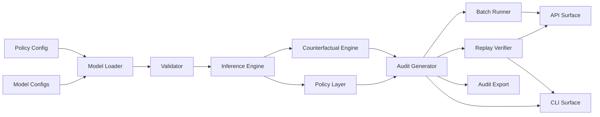

# causal-credit-risk-engine


[](https://doi.org/10.5281/zenodo.19779499)

Config-driven causal inference engine for explainability experiments in credit-risk governance, counterfactuals, and audit traces.

`causal-credit-risk-engine` is a production-style Python package for demonstrating how causal AI can support explainability, human oversight, decision traceability, and governance workflows in high-risk AI contexts.

> Warning: Source-available under BUSL-1.1. Reference implementation only; not for lending, credit eligibility, or production decisioning.

## What this is

`causal-credit-risk-engine` is a source-available reference implementation for turning model outputs from high-risk AI use-case simulations into replayable, inspectable governance artifacts.

It demonstrates a config-driven causal DAG workflow with decision pathways, counterfactuals, deterministic replay, and audit-chain integrity checks.

It is an explainability and governance layer, not a production lending system.

## Research note

A technical brief describing the architecture is available on Zenodo:

- DOI: https://doi.org/10.5281/zenodo.19779499
- Record: https://zenodo.org/records/19779499

The paper describes the causal audit-trace pattern behind this repository: config-driven causal reasoning, deterministic replay, audit-chain integrity, fairness diagnostics, and governance-oriented decision artifacts.

## Public institutional validation

`causal-credit-risk-engine` now includes a public institutional validation path using mortgage datasets from Freddie Mac, Fannie Mae, and HMDA/CFPB.

This validation path is designed to exercise the engine on public historical financial datasets while keeping the reference demo model unchanged.

Current validation coverage:

- Freddie Mac single-family loan-level data
- Fannie Mae single-family historical performance data
- HMDA / CFPB modified loan/application register data
- normalized public mortgage input generation
- public mortgage model and policy configuration
- batch decision generation
- fairness diagnostics
- deterministic replay checks
- audit-chain verification
- sampled evidence-pack export

Example run summary:

- Rows processed: 30,000
- Accepted rows: 30,000
- Rejected rows: 0
- Datasets used: Freddie Mac, Fannie Mae, HMDA/CFPB
- Decision distribution: APPROVE 9,584 | REVIEW 4,368 | DECLINE 16,048
- Replay success rate: 1.0
- Audit-chain verification: true
- Evidence-pack mode: sampled, 1,000 rows

This is public institutional loan-level validation, not production validation. It does not use customer data, does not make real credit eligibility decisions, and does not prove regulatory compliance.

Run public validation:

```bash
python scripts/run_public_mortgage_validation.py --input <normalized_csv> --model-config configs/public_mortgage_model.v1.json --policy-config configs/public_mortgage_policy.v1.json --use-model-config-as-is --max-audits 200
```

## Executive positioning

`causal-credit-risk-engine` is a config-driven causal decision-audit engine for credit-risk governance workflows: it loads versioned model and policy definitions, produces deterministic decisions and counterfactual explanations, and emits replayable audit artifacts that model-risk, compliance, internal-audit, and engineering teams can inspect independently. It is intended as an explainability and control layer alongside existing decision systems (via CLI or API), not as a production lending adjudication engine or regulatory certification artifact.

## Capability summary

- Versioned model and policy configuration runtime with schema validation at load time.
- Exact inference for discrete causal DAGs plus intervention-style counterfactual generation.
- Deterministic replay checks and tamper-evident audit-chain verification for investigation evidence.
- Batch CSV processing and FastAPI endpoints with row-level decision and error outputs.
- Subgroup fairness diagnostics and evidence-pack export workflow for governance review.

## Architecture



## Audit output

Every decision can produce a structured JSON audit record containing:

- input evidence
- inferred nodes
- risk probability
- decision
- causal chain
- counterfactuals
- model and policy versions
- validation status

## How this integrates

`causal-credit-risk-engine` is intended for pilot use beside existing risk, compliance, and audit workflows as an explainability layer.

- Batch workflow: process CSV evidence into row-level decisions and governance artifacts.
- API workflow: expose decision/replay/batch endpoints in internal environments, with enterprise controls added at deployment.
- Audit workflow: export replayable JSON decision traces to governance systems.
- MRM workflow: review causal assumptions, verify policy behavior, and track versioned decision outputs over time.

## Install

Requires Python 3.10 or newer.

```bash
python -m venv .venv
```

Windows PowerShell:

```powershell
.venv\Scripts\Activate.ps1
```

macOS/Linux:

```bash
source .venv/bin/activate
```

Install:

```bash
pip install -e ".[dev]"
```

Install verification:

```bash
python -m pytest -q
python -m causal_credit_risk.cli --json-only
```

## CLI usage

Decision audit output:

```bash
python -m causal_credit_risk.cli --json-only
```

Replay a saved audit record:

```bash
python -m causal_credit_risk.cli --replay-audit examples/audit_example.json
```

Batch mode:

```bash
python -m causal_credit_risk.cli --batch-csv-input ./input.csv --batch-csv-output ./output.csv
```

Batch mode with subgroup passthrough:

```bash
python -m causal_credit_risk.cli --batch-csv-input ./input.csv --batch-csv-output ./output.csv --batch-subgroup-column segment
```

Example `input.csv`:

```csv
tenure,utilization
short,high
long,low
```

DOT export:

```bash
python -m causal_credit_risk.cli --export-dot ./causal_dag.dot --json-only
```

Render with Graphviz:

```bash
dot -Tpng causal_dag.dot -o causal_dag.png
```

Fairness diagnostics from CSV/JSON rows:

```bash
python -m causal_credit_risk.cli --fairness-report-input ./output.csv --fairness-subgroup-column segment
```

Verify audit-chain records:

```bash
python -m causal_credit_risk.cli --verify-audit-chain ./examples/audit_chain.example.json
```

If running directly from source without installation:

Windows PowerShell:

```powershell
$env:PYTHONPATH='src'
python -m causal_credit_risk.cli
```

macOS/Linux:

```bash
PYTHONPATH=src python -m causal_credit_risk.cli
```

The CLI supports UTF-8 and UTF-8 BOM encoded JSON/CSV files, including files produced by common Windows tooling.

## API usage

FastAPI app entrypoint:

- `causal_credit_risk.api:app`

Quick start:

```bash
uvicorn causal_credit_risk.api:app --reload
curl -s http://127.0.0.1:8000/healthz
```

Routes:

- `GET /healthz` -> `{"status":"ok"}`
- `GET /readyz` -> validates model/policy load and basic runtime health (not production readiness)
- `POST /v1/decision` -> decision/audit payload for submitted evidence
- `POST /v1/replay` -> deterministic replay check against active model/policy
- `POST /v1/batch` -> row-level decision outputs or row-level errors
- `POST /v1/fairness` and `POST /v1/fairness/report` -> subgroup fairness diagnostics
- `POST /v1/audit-chain/verify` -> audit hash-chain integrity verification

Auth is intentionally not included in the local package. Apply authentication and authorization at the deployment boundary.

OpenAPI export:

```bash
python scripts/export_openapi.py
```

Generated schema:

- `examples/openapi.json`

## Documentation map

- Architecture and model context: [`MODEL_CARD.md`](MODEL_CARD.md), [`docs/architecture.md`](docs/architecture.md), [`docs/config_schema.md`](docs/config_schema.md), [`docs/model_governance_lifecycle.md`](docs/model_governance_lifecycle.md)
- API and deployment boundaries: [`docs/api_examples.md`](docs/api_examples.md), [`docs/openapi.md`](docs/openapi.md), [`docs/integration_boundaries.md`](docs/integration_boundaries.md), [`docs/enterprise_seams.md`](docs/enterprise_seams.md)
- Replay, audit integrity, and fairness: [`docs/replay_proof.md`](docs/replay_proof.md), [`docs/audit_integrity.md`](docs/audit_integrity.md), [`docs/fairness_report.md`](docs/fairness_report.md), [`docs/evidence_pack_workflow.md`](docs/evidence_pack_workflow.md)
- Security and governance controls: [`docs/security_posture.md`](docs/security_posture.md), [`docs/security_checklist.md`](docs/security_checklist.md), [`docs/privacy_pii.md`](docs/privacy_pii.md), [`docs/data_governance.md`](docs/data_governance.md)
- Evaluation and buyer readiness: [`docs/end_to_end_workflow.md`](docs/end_to_end_workflow.md), [`docs/commercial_pilot.md`](docs/commercial_pilot.md), [`docs/known_limitations.md`](docs/known_limitations.md), [`docs/pilot_evaluation_plan.md`](docs/pilot_evaluation_plan.md), [`docs/procurement_faq.md`](docs/procurement_faq.md), [`docs/buyer_demo_script.md`](docs/buyer_demo_script.md), [`docs/release_notes_v0.2.0.md`](docs/release_notes_v0.2.0.md)

## Examples

Included examples:

- `examples/audit_example.json` (saved audit record for deterministic replay)
- `examples/input.csv` (batch/fairness demo input)
- `examples/batch_with_segments.csv` (batch/fairness input with subgroup labels)
- `examples/batch_output.example.csv` (batch decision output with row hash-chain fields)
- `examples/fairness_report.example.json` (fairness diagnostics output)
- `examples/audit_chain.example.json` (tamper-evident chain records)
- `examples/openapi.json` (exported OpenAPI schema)
- `examples/api_decision_request.json`
- `examples/api_decision_response.json`
- `examples/replay_match.example.json`
- `examples/api_error_invalid_evidence.example.json`
- `examples/api_error_malformed_payload.example.json`
- `examples/audit_chain_verify_success.example.json`
- `examples/audit_chain_verify_failure.example.json`
- `examples/api_fairness_request.json`
- `examples/api_fairness_response.json`

## License

This project is licensed under the Business Source License 1.1.

The source code is available for review, learning, testing, and non-production use. Commercial production use requires written permission from the Licensor.

License terms:

- License: Business Source License 1.1
- Licensor: Antiparty, Inc. | Tionne Smith
- Licensed Work: causal-credit-risk-engine
- Additional Use Grant: non-production use only
- Change Date: 2030-04-26
- Change License: Apache License 2.0

This means the project is source-available now and converts to Apache-2.0 on the Change Date.

## Commercial licensing

Commercial production use requires written permission from the Licensor.

Available commercial paths:

- **Evaluation pilot:** limited internal evaluation, non-production use only.
- **Paid commercial license:** required for production deployment, customer-facing use, regulated workflow use, or integration into commercial software.
- **Support boundary:** commercial support can include integration guidance, deployment review, configuration review, audit-output review, and governance documentation support. It does not include legal advice, credit-policy approval, fairness certification, adverse-action review, or certified regulatory compliance.

For commercial licensing, contact: smith@antiparty.co
